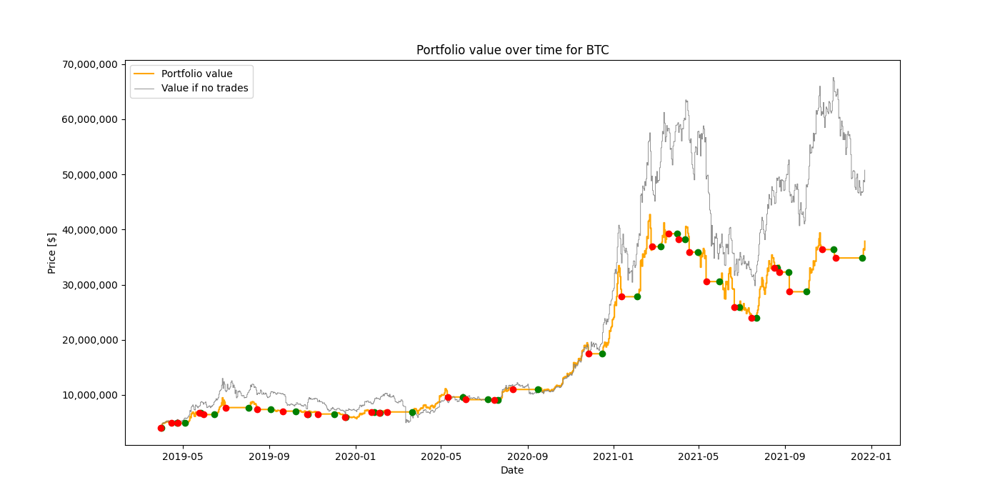
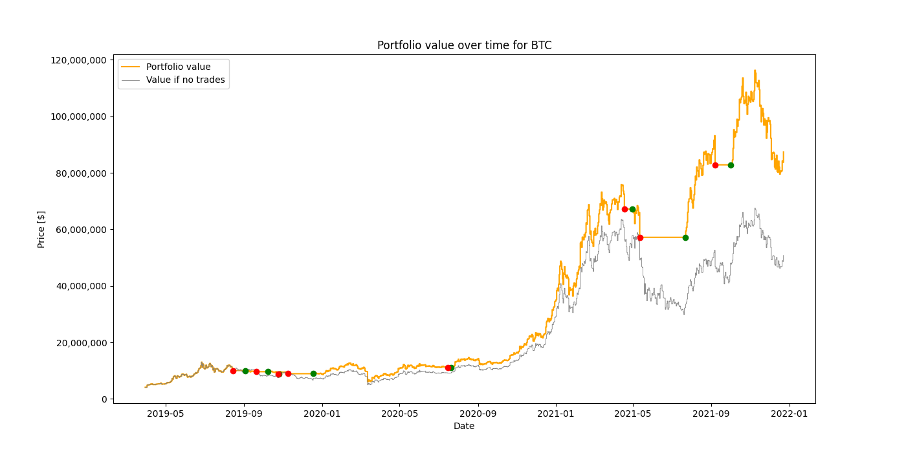

# MACD and Williams %R Trading Indicators

This repository contains the implementation of MACD (Moving Average Convergence Divergence) and Williams %R trading indicators with their analysis. These are popular technical analysis tools used to identify potential buy and sell signals in financial markets.

## Examples

### MACD for BTC

- Initial Investment: **4.092 million USD**
- Final Value: **37.885 million USD**

### MACD with Williams %R for BTC

- Initial Investment: **4.092 million USD**
- Final Value: **87,427mln USD**

## Features

- Calculation of MACD line and signal line
- Calculation of Williams %R and integration with MACD
- Generation of buy and sell signals
- Visualization of MACD and signal lines

## Folder Structure

- `CSV/`: Sample CSV data files for testing the indicators.
- `Images/`: Result images generated by the MACD analysis.
- `R_Images/`: Result images generated by the MACD analysis with Williams %R.
- `macd_analysis.pdf`: Detailed analysis of the MACD indicator.
- `macd.py`: Main Python script for the MACD trading indicator.

## Usage

Run the `macd.py` file to test indicators and see effects visualized on graphs.